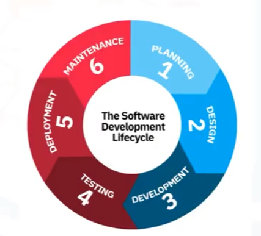
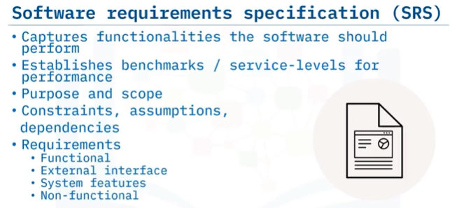
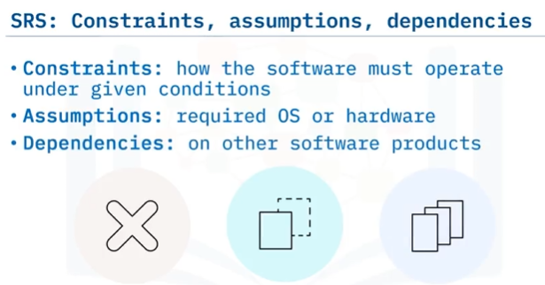
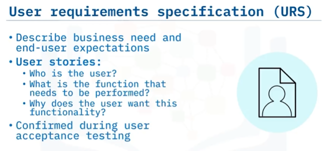
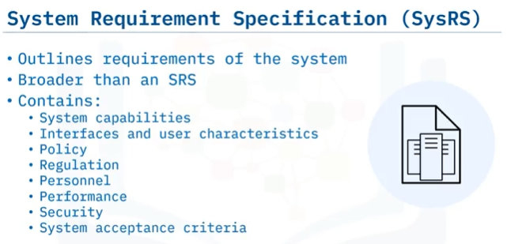

### Phases of Software Development Lifecycle - SDLC

Planning

- SRS - Software Requirements Specification are:
  - Gathered
  - Analyzed
  - Documented
  - Priotized

Design

- SRS to develop architecure

Development

- Coding

Testing

- Code is tested to ensure stability, security and that it meets requirements from srs
- Bugs reported, racked, fixed and retestet

Deployment

- Code realesed to production environment

Maintance

- Stakeholder feedback, issues/bugs identified, code enhancements suggested

### Building Quality Software

User Acceptence Testing (UAT) or Beta testing

**Realeases**  
Alpha

- Select stakeholders
- May conain errors
- Design changes may occur

Beta

- Alla stakeholders
- User testing
- Meet requirements

General Availability

- Stable
- All users

### Requirements

> ### Steps to gathering requirements
>
>  >  > 
>
> ### Requirements documentation
>
>  >  >  > 
